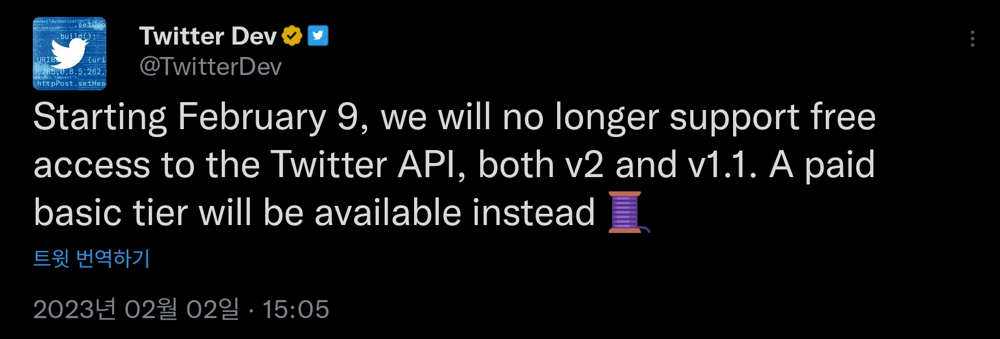

DEAD PROJECT
============

> https://twitter.com/TwitterDev/status/1621026986784337922?t=Lvrm1F29dMGjXHfJbnHU2A&s=19

Now there is no any reason to keep developing this program, as the program is targeted to be an 'free' alternative for paid Tweet cleaner services.

Source code is now archived, and no further changes will be made here.

Twiper
======

 **Twiper** *(pronounce as T-wee-per)* is an on-your-own Tweet cleaner, without paying commercial services but in really manual way.

 This is a sequel project of [twitter-pwa-archive-cleaner](https://github.com/SDSkyKlouD/twitter-pwa-archive-cleaner).

 This project is in early development, so no detailed instructions have been prepared yet. Use with caution!

License
-------
 **Twiper** is being published under [**GNU AGPL v3**](LICENSE.md), with caveats from the author:
   - **DO NOT USE/STEAL/REFERENCE/(WHATEVER DOING SOME RELATED)** THIS PROJECT in COMMERCIAL TWEET CLEANER SERVICES!!!!!!  
     No, not a money related thing, just I hate kind of 'em
